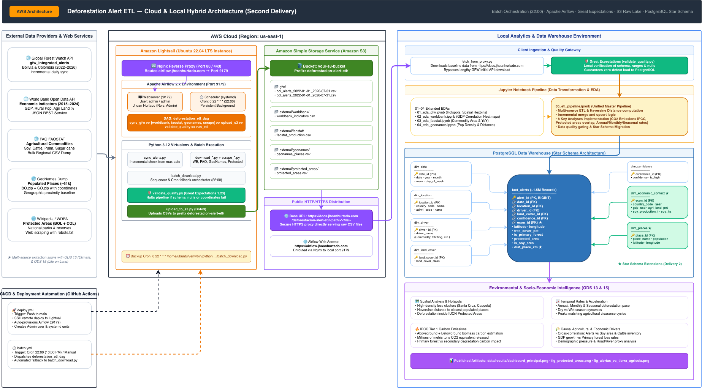
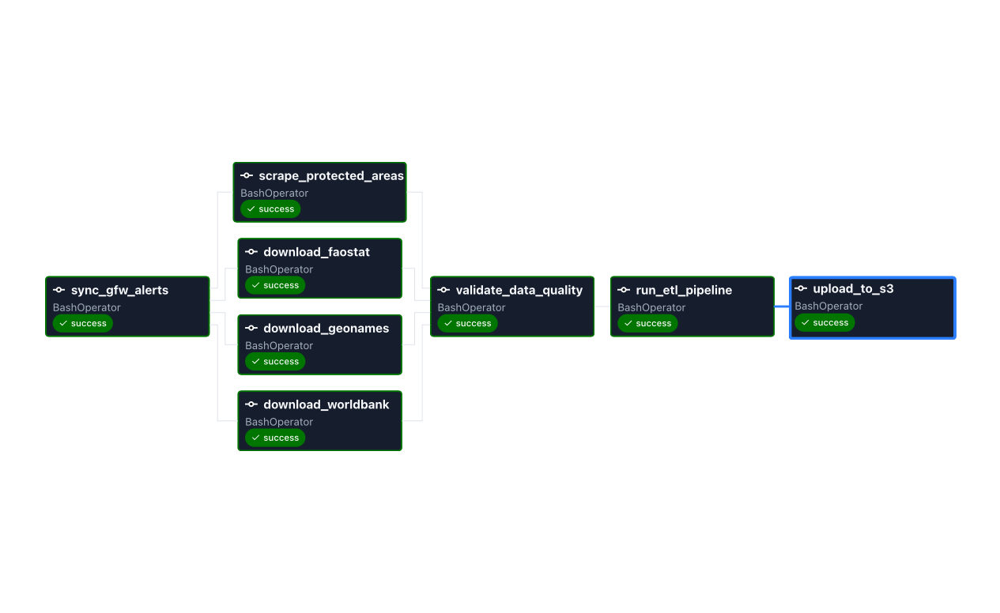
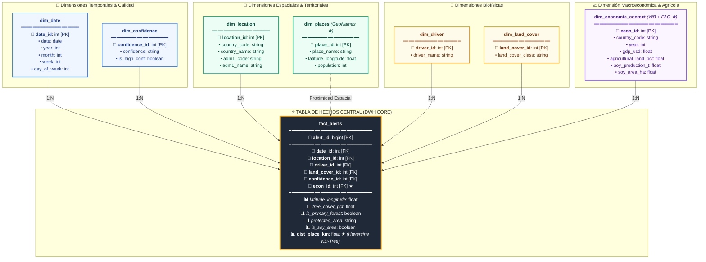
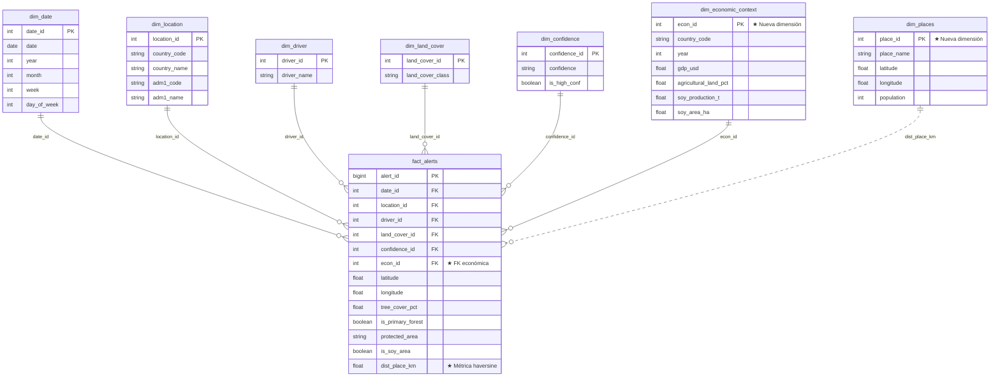

# 🌳 Deforestation Alert ETL — Segunda Entrega

Pipeline ETL automatizado para el análisis de alertas de deforestación en Bolivia y Colombia (2022–2026).  
Proyecto académico — **ETL (G51)** · Ingeniería de Datos e Inteligencia Artificial.

Alineado con **ODS 13 — Acción por el clima** y **ODS 15 — Vida de ecosistemas terrestres**.

---

## Tabla de contenidos

- [Arquitectura](#arquitectura)
- [Orquestación con Apache Airflow](#orquestación-con-apache-airflow)
- [Control de Calidad (Great Expectations)](#control-de-calidad-great-expectations)
- [Fuentes de datos y Storage S3](#fuentes-de-datos-y-storage-s3)
- [Estructura del proyecto](#estructura-del-proyecto)
- [Scripts — qué hace cada uno](#scripts--qué-hace-cada-uno)
- [Notebooks — orden de ejecución](#notebooks--orden-de-ejecución)
- [Instalación y configuración](#instalación-y-configuración)
- [Cómo ejecutar el pipeline](#cómo-ejecutar-el-pipeline)
- [Despliegue en AWS Lightsail](#despliegue-en-aws-lightsail)
- [GitHub Actions CI/CD](#github-actions-cicd)
- [Modelo de datos](#modelo-de-datos-star-schema)
- [Alineación con los ODS](#alineación-con-los-ods)

---

## Arquitectura



> El diagrama editable en formato draw.io (estilo AWS Architecture) está disponible en [`docs/architecture.drawio`](docs/architecture.drawio).

### Diagrama de Flujo del Pipeline (Mermaid)

```mermaid
flowchart LR
    %% Subgrafo 1: Fuentes de Datos
    subgraph G1 ["🌐 1. Fuentes Externas"]
        direction TB
        S_GFW["🛰️ <b>Global Forest Watch</b><br/><i>API REST (Alertas 2022-2026)</i>"]
        S_WB["🏛️ <b>World Bank Open Data</b><br/><i>API REST (PIB, Tierra Agrícola)</i>"]
        S_FAO["🌾 <b>FAO FAOSTAT</b><br/><i>Bulk CSV (Producción y Soya)</i>"]
        S_GEO["📍 <b>GeoNames</b><br/><i>Data Dump (Localidades BOL/COL)</i>"]
        S_PA["🏞️ <b>WDPA / Protected Areas</b><br/><i>Web Scraping (Parques Naturales)</i>"]
    end

    %% Subgrafo 2: AWS Cloud & Orquestación
    subgraph G2 ["☁️ 2. AWS Lightsail & Orquestación"]
        direction TB
        GHA["🚀 <b>GitHub Actions</b><br/><i>Cron 22:00 UTC / Push main</i>"]
        
        subgraph LIGHTSAIL ["🖥️ AWS Lightsail (Ubuntu 22.04)"]
            direction TB
            AIRFLOW["🌪️ <b>Apache Airflow (:9179)</b><br/><i>DAG: deforestation_etl_dag</i>"]
            
            subgraph SCRIPTS ["⚙️ Extracción & Carga"]
                direction TB
                SYNC["sync_alerts.py<br/><i>(Incremental GFW)</i>"]
                EXT["download_*.py / scrape_*.py<br/><i>(Fuentes secundarias)</i>"]
                UP["upload_to_s3.py"]
            end
        end
    end

    %% Subgrafo 3: Almacenamiento & Distribución
    subgraph G3 ["🪣 3. Storage & Distribución"]
        direction TB
        S3[("Amazon S3 Bucket<br/><b>deforestacion-alert-etl/</b><br/>├── gfw/*.csv<br/>└── external/*/*.csv")]
        PROXY["🔀 <b>HTTPS Data Proxy</b><br/><code>docs.jhoanhurtado.com</code>"]
    end

    %% Subgrafo 4: Control de Calidad & Procesamiento
    subgraph G4 ["🛡️ 4. Calidad & ETL Pipeline"]
        direction TB
        FETCH["fetch_from_proxy.py<br/><i>Descarga rápida baseline</i>"]
        GX["🛡️ <b>Great Expectations</b><br/><i>validate_quality.py</i><br/>✔️ Rangos espaciales BOL/COL<br/>✔️ No nulidad y completitud"]
        NOTEBOOK["📓 <b>05_etl_pipeline.ipynb</b><br/><i>Limpieza, enriquecimiento<br/>y cruce espacial KD-Tree</i>"]
    end

    %% Subgrafo 5: Data Warehouse & Entrega de Valor
    subgraph G5 ["📊 5. Data Warehouse & Analítica"]
        direction TB
        DWH[("🐘 <b>PostgreSQL DWH</b><br/>Star Schema Dimensional<br/><i>fact_alerts + 7 dimensiones</i>")]
        VIZ["📈 <b>Análisis & Insights</b><br/>• Hotspots & Clusters de alerta<br/>• Emisiones CO₂ (Tier 1 IPCC)<br/>• Expansión frontera agrícola"]
        ODS["🎯 <b>Impacto ODS</b><br/>• ODS 13: Acción por el Clima<br/>• ODS 15: Ecosistemas Terrestres"]
    end

    %% Flujos de conexión y dependencias
    GHA -- "Trigger diario" --> AIRFLOW
    AIRFLOW --> SYNC & EXT
    G1 --> SYNC & EXT
    SYNC & EXT --> UP
    UP --> S3
    S3 --> PROXY
    PROXY --> FETCH
    FETCH --> GX
    GX -- "Quality Gate OK" --> NOTEBOOK
    NOTEBOOK -- "Carga Incremental" --> DWH
    DWH --> VIZ
    VIZ --> ODS

    %% Estilos visuales con paleta profesional
    classDef sourceStyle fill:#EBF5FB,stroke:#2980B9,stroke-width:2px,color:#1B4F72;
    classDef awsStyle fill:#FEF5E7,stroke:#D35400,stroke-width:2px,color:#7E5109;
    classDef s3Style fill:#E8F8F5,stroke:#16A085,stroke-width:2px,color:#0E6251;
    classDef gxStyle fill:#EAFAF1,stroke:#27AE60,stroke-width:2px,color:#145A32;
    classDef dwhStyle fill:#F4ECF7,stroke:#8E44AD,stroke-width:2px,color:#512E5F;

    class S_GFW,S_WB,S_FAO,S_GEO,S_PA sourceStyle;
    class GHA,AIRFLOW,SYNC,EXT,UP awsStyle;
    class S3,PROXY s3Style;
    class FETCH,GX,NOTEBOOK gxStyle;
    class DWH,VIZ,ODS dwhStyle;
```



---

## Orquestación con Apache Airflow

El pipeline está orquestado mediante **Apache Airflow**, ejecutándose automáticamente todas las noches a las **22:00 (10:00 PM)** (`0 22 * * *`).

### Visualización del DAG (`deforestation_etl_dag`)



> **Ruta de imagen git compatible:** [`docs/img/deforestation_etl_dag-graph.png`](docs/img/deforestation_etl_dag-graph.png).

### Acceso a la interfaz Web de Airflow
- **URL pública / Subdominio:** `https://airflow.jhoanhurtado.com` redirigido mediante Nginx reverse proxy al puerto local **9179**.
- **Credenciales automáticas:**
  - **Usuario:** `admin`
  - **Contraseña:** `admin`
  - **Nombre:** Jhoan Hurtado
  - **Email:** `jhoanezequielh@gmail.com`
  - **Rol:** `Admin`

### Pipeline de Tareas en el DAG
1. `sync_gfw_alerts`: Descarga incremental de alertas GFW (omite descarga masiva la primera vez, verificando únicamente días nuevos desde la última ejecución).
2. `download_worldbank`, `download_faostat`, `download_geonames`, `scrape_protected_areas`: Extracciones paralelas de fuentes externas.
3. `upload_to_s3`: Sube los CSVs crudos con nombres reales al bucket S3 bajo el prefijo `deforestacion-alert-etl/`.
4. `validate_data_quality`: Suite de **Great Expectations** que valida tipos, completitud y rangos espaciales. Si falla la calidad, detiene la carga a base de datos.
5. `run_etl_pipeline`: Ejecuta la transformación unificada y carga incremental a PostgreSQL (Star Schema).

---

## Control de Calidad (Great Expectations)

Para cumplir con los criterios de validación de calidad de datos exigidos para la segunda entrega, se integra el script [`scripts/validate_quality.py`](scripts/validate_quality.py) respaldado por **Great Expectations (GX)**:
- **Alertas GFW:** Valida columnas mandatorias (`latitude`, `longitude`, `alert__date`, `confidence__cat`), no nulidad en coordenadas y rangos geográficos válidos (latitud en `[-23, 14]`, longitud en `[-80, -57]`).
- **World Bank:** Valida presencia de columnas clave, códigos ISO (`BOL`, `COL`) y rango temporal (`year >= 2010`).
- **GeoNames:** Valida completitud de nombres de localidades y rangos de coordenadas válidos.
- **Áreas Protegidas:** Valida nombres y categorías de manejo IUCN.

---

## Fuentes de datos y Storage S3

Todos los datasets están **100% excluidos del repositorio Git** mediante `.gitignore`. Deben residir en el bucket S3 bajo el prefijo `deforestacion-alert-etl/` para ser consumidos tanto por los notebooks analíticos como por el pipeline de Lightsail.

### Mapeo de Datasets, Rutas S3 y URLs del Proxy

| # | Dataset / Contenido | Ruta en S3 (`s3://<bucket>/`) | URL Proxy de Descarga (`https://docs.jhoanhurtado.com/`) | Ruta Local Destino |
|---|---------------------|-------------------------------|----------------------------------------------------------|--------------------|
| 1 | **GFW Alertas Bolivia (2022–2026)** | `deforestacion-alert-etl/gfw/bol_alerts_2022-01-01_2026-07-31.csv` | `https://docs.jhoanhurtado.com/deforestacion-alert-etl/gfw/bol_alerts_2022-01-01_2026-07-31.csv` | `data/csv/bol_alerts_2022-01-01_2026-07-31.csv` |
| 2 | **GFW Alertas Colombia (2022–2026)** | `deforestacion-alert-etl/gfw/col_alerts_2022-01-01_2026-07-31.csv` | `https://docs.jhoanhurtado.com/deforestacion-alert-etl/gfw/col_alerts_2022-01-01_2026-07-31.csv` | `data/csv/col_alerts_2022-01-01_2026-07-31.csv` |
| 3 | **World Bank Indicadores Económicos** | `deforestacion-alert-etl/external/worldbank/worldbank_indicators.csv` | `https://docs.jhoanhurtado.com/deforestacion-alert-etl/external/worldbank/worldbank_indicators.csv` | `data/external/worldbank/worldbank_indicators.csv` |
| 4 | **FAOSTAT Producción Agropecuaria** | `deforestacion-alert-etl/external/faostat/faostat_production.csv` | `https://docs.jhoanhurtado.com/deforestacion-alert-etl/external/faostat/faostat_production.csv` | `data/external/faostat/faostat_production.csv` |
| 5 | **GeoNames Localidades Pobladas** | `deforestacion-alert-etl/external/geonames/geonames_places.csv` | `https://docs.jhoanhurtado.com/deforestacion-alert-etl/external/geonames/geonames_places.csv` | `data/external/geonames/geonames_places.csv` |
| 6 | **Áreas Protegidas y Parques Nacionales** | `deforestacion-alert-etl/external/protected_areas/protected_areas.csv` | `https://docs.jhoanhurtado.com/deforestacion-alert-etl/external/protected_areas/protected_areas.csv` | `data/external/protected_areas/protected_areas.csv` |

> 💡 **Subida manual:** Si subes los archivos manualmente a S3 desde la consola de AWS o AWS CLI, colócalos exactamente en las rutas listadas en la columna *Ruta en S3*. Automáticamente quedarán expuestos en las URLs públicas del proxy y serán consumidos por los notebooks sin necesidad de descargas repetitivas por API.

---

## Estructura del proyecto

```
deforestation-alert-etl/
├── .github/
│   └── workflows/
│       ├── deploy.yml          # CI/CD: deploy scripts y Airflow a Lightsail (push main)
│       └── batch.yml           # Cron diario (22:00): ejecuta DAG / batch en Lightsail
├── dags/
│   └── deforestation_etl_dag.py # DAG de Apache Airflow (schedule 22:00)
├── data/
│   ├── csv/                    # CSVs GFW (excluidos del repo por .gitignore)
│   ├── external/               # Datasets externos (excluidos del repo)
│   │   ├── worldbank/
│   │   ├── faostat/
│   │   ├── geonames/
│   │   └── protected_areas/
│   └── results/                # Figuras generadas por los notebooks
├── docs/
│   ├── architecture.drawio     # Diagrama de arquitectura (editable)
│   ├── setup.md                # Instrucciones detalladas de configuración
│   ├── datasets_externos.md    # Documentación de fuentes externas
│   └── img/
│       └── deforestation_etl_dag-graph.png     # Captura de pantalla de la interfaz de Airflow
├── notebooks/
│   ├── 01_eda_gfw.ipynb        # EDA del dataset GFW raw
│   ├── 02_eda_worldbank.ipynb  # EDA indicadores World Bank
│   ├── 03_eda_faostat.ipynb    # EDA producción FAO
│   ├── 04_eda_geonames.ipynb   # EDA localidades GeoNames
│   └── 05_etl_pipeline.ipynb   # ETL unificado + 8 análisis analíticos + Star Schema
├── scripts/
│   ├── batch_download.py       # Orquestador: ejecuta downloads + quality + S3
│   ├── sync_alerts.py          # Descarga incremental de alertas GFW (evita full download inicial)
│   ├── download_dataset.py     # Descarga completa histórica GFW
│   ├── download_worldbank.py   # Descarga indicadores World Bank API
│   ├── download_faostat.py     # Descarga producción agrícola FAO (bulk CSV)
│   ├── download_geonames.py    # Descarga localidades pobladas GeoNames
│   ├── scrape_protected_areas.py # Extracción de parques y reservas naturales
│   ├── validate_quality.py     # Great Expectations — suite de validación de calidad
│   ├── upload_to_s3.py         # Sube CSVs al bucket S3 (prefijo deforestacion-alert-etl/)
│   ├── fetch_from_proxy.py     # Descarga CSVs desde https://docs.jhoanhurtado.com
│   └── gfw_signup.py           # Registro y obtención de API key GFW
├── config/
│   └── airflow_local.cfg       # Configuración base de desarrollo para Apache Airflow local
├── .env.example                # Plantilla de variables de entorno
├── .gitignore
├── start_airflow_local.sh      # Script 100% automático para inicializar y lanzar Airflow localmente
├── requirements.txt
└── README.md
```

---

## Scripts — qué hace cada uno

### `validate_quality.py` ★
Control de calidad formal de datos con **Great Expectations**. Ejecuta suites de expectativas sobre los CSVs de GFW, World Bank, GeoNames y Áreas Protegidas antes de permitir la inserción a base de datos.
```bash
python scripts/validate_quality.py
```

### `batch_download.py`
Orquestador de extracción y carga. Llama en secuencia a todos los scripts de descarga, valida calidad con Great Expectations y luego sube a S3. Diseñado para correr como tarea programada o fallback a las 22:00.

```bash
python scripts/batch_download.py                  # descarga todo + quality check + S3
python scripts/batch_download.py --skip-gfw       # omite GFW (solo externos)
python scripts/batch_download.py --skip-quality   # omite control de calidad
python scripts/batch_download.py --skip-upload    # no sube a S3
```

### `sync_alerts.py`
Descarga incremental de alertas GFW. Detecta automáticamente la última fecha en el CSV existente y descarga solo los días nuevos. Usa ventanas adaptativas por densidad de alertas.

```bash
python scripts/sync_alerts.py                     # desde última fecha hasta ayer
python scripts/sync_alerts.py --daily             # solo el día de ayer (modo cron)
python scripts/sync_alerts.py --from 2026-01-01   # fuerza inicio desde esa fecha
python scripts/sync_alerts.py --country BOL       # solo un país
```

### `download_dataset.py`
Descarga inicial completa del dataset GFW. Genera los CSVs históricos completos para BOL y COL. Solo necesario la primera vez.

```bash
python scripts/download_dataset.py   # menú interactivo
```

### `download_worldbank.py`
Descarga 4 indicadores del World Bank API para Bolivia y Colombia (2015–2024): PIB, población rural, tierra agrícola y exportaciones agrícolas.

```bash
python scripts/download_worldbank.py
# Salida: data/external/worldbank/worldbank_indicators.csv
```

### `download_faostat.py`
Descarga el bulk CSV de producción agrícola de FAOSTAT para Américas y filtra Bolivia y Colombia. Productos: Soybeans, Cattle, Sugar cane, Oil palm fruit.

```bash
python scripts/download_faostat.py
# Salida: data/external/faostat/faostat_production.csv
```

### `download_geonames.py`
Descarga los dumps ZIP de GeoNames para Bolivia (BO.zip) y Colombia (CO.zip) y extrae todas las localidades pobladas (~61k lugares con lat/lon).

```bash
python scripts/download_geonames.py
# Salida: data/external/geonames/geonames_places.csv
```

### `upload_to_s3.py`
Sube todos los CSVs de `data/csv/` y `data/external/` al bucket S3 bajo el prefijo `deforestacion-alert-etl/`.
- **Eliminación automática:** Tras confirmar la subida exitosa a S3, elimina automáticamente las copias locales para ahorrar espacio y cumplir la política de almacenamiento.
- **Trazabilidad y Logs:** Registra cada archivo subido y eliminado en `logs/s3_upload.log` y sincroniza el archivo de log al bucket S3 (`deforestacion-alert-etl/logs/`).

```bash
python scripts/upload_to_s3.py                  # sube a S3 y elimina locales automáticamente
python scripts/upload_to_s3.py --keep-local     # sube a S3 conservando copias locales
python scripts/upload_to_s3.py --dry-run        # muestra qué subiría sin realizar cambios
```

### `fetch_from_proxy.py`
Descarga los CSVs desde el proxy inverso (`https://docs.jhoanhurtado.com/deforestacion-alert-etl/...`) al entorno local.
- **Detección inteligente:** Si el archivo local ya existe, lo utiliza directamente sin descargar innecesariamente.
- **Fuerza descarga:** Permite `--force` para sobreescribir.

```bash
python scripts/fetch_from_proxy.py              # descarga solo los que no existan
python scripts/fetch_from_proxy.py --force      # fuerza la descarga de todos
python scripts/fetch_from_proxy.py --only gfw   # solo alertas GFW
python scripts/fetch_from_proxy.py --only external  # solo datasets externos
```

### `gfw_signup.py`
Registra un email en la API de Global Forest Watch y obtiene la API key. Solo necesario la primera vez.

```bash
python scripts/gfw_signup.py
```

---

## Notebooks — orden de ejecución

| Orden | Notebook | Propósito |
|-------|----------|-----------|
| 1 | `01_eda_gfw.ipynb` | EDA del CSV raw GFW. §1-4: estructura, calidad, distribuciones. §5: tasas de cambio temporal. §6: patrones espaciales (hexbin, drivers). §7: causalidad con indicadores económicos. §8: proximidad a centros poblados. |
| 2 | `02_eda_worldbank.ipynb` | EDA indicadores económicos. §1-4: estructura, tendencias de PIB, tierra agrícola y población rural 2015–2024. **Análisis extendido:** correlaciones entre indicadores (heatmap) y tendencias normalizadas (base=100). |
| 3 | `03_eda_faostat.ipynb` | EDA producción agrícola. §1-4: estructura, producción por cultivo y área cosechada. **Análisis extendido:** composición de producción (área apilada) y variación YoY por commodity. |
| 4 | `04_eda_geonames.ipynb` | EDA localidades pobladas. §1-5: estructura, distribución geográfica, población, top localidades. **Análisis extendido:** top-10 más poblados por país y densidad espacial (hexbin). |
| 5 | `05_etl_pipeline.ipynb` | **Pipeline completo:** carga las 4 fuentes → transforma → merge → migra al star schema → carga incremental → EDA desde DB → visualizaciones integradas. |

---

## Instalación y configuración

### 1. Clonar el repositorio

```bash
git clone https://github.com/<tu-usuario>/deforestation-alert-etl.git
cd deforestation-alert-etl
```

### 2. Crear entorno virtual con Python 3.12

```bash
python3.12 -m venv venv
source venv/bin/activate        # Windows: venv\Scripts\activate
```

### 3. Instalar dependencias

```bash
pip install -r requirements.txt
```

> **Nota macOS (Homebrew):** si `pip` falla con `externally-managed-environment`, asegúrate de estar dentro del venv (`which python` debe apuntar a `venv/bin/python`).

### 4. Configurar variables de entorno

```bash
cp .env.example .env
# Edita .env con tus credenciales
```

Variables requeridas:

| Variable | Descripción |
|----------|-------------|
| `GFW_API_KEY` | API key de Global Forest Watch |
| `PG_USER` / `PG_PASSWORD` / `PG_HOST` / `PG_PORT` / `PG_DB` | Conexión PostgreSQL |
| `S3_BUCKET` | Nombre del bucket S3 |
| `AWS_ACCESS_KEY_ID` / `AWS_SECRET_ACCESS_KEY` / `AWS_REGION` | Credenciales AWS |
| `DATA_PROXY_URL` | URL base del proxy inverso que expone los CSVs desde S3 |

### 5. Crear la base de datos PostgreSQL

```bash
# macOS
brew install postgresql@16
brew services start postgresql@16
psql -U postgres -c "CREATE DATABASE deforestation;"
```

### 6. Obtener API key de GFW (primera vez)

```bash
python scripts/gfw_signup.py
# Copia la key generada en .env → GFW_API_KEY
```

---

## Cómo ejecutar el pipeline

### Opción A — Ejecución local completa vía Terminal (Script automatizado)

Esta es la forma más rápida y directa de correr todo el pipeline localmente sin abrir interfaces gráficas:

```bash
# 1. Asegúrate de tener tu entorno virtual activo y el .env configurado
source venv/bin/activate

# 2. Descargar los datasets consolidados desde el almacenamiento S3 (vía Proxy HTTPS)
python scripts/fetch_from_proxy.py

# 3. (Opcional) Sincronizar alertas adicionales recientes desde la API de GFW
python scripts/sync_alerts.py --daily

# 4. Validar calidad e integridad de los datos con Great Expectations
python scripts/validate_quality.py

# 5. Ejecutar el pipeline ETL completo y cargar los datos a PostgreSQL
jupyter nbconvert --to notebook --execute notebooks/05_etl_pipeline.ipynb --output notebooks/05_etl_pipeline_executed.ipynb

# 6. Sincronizar resultados a S3 y limpiar archivos locales temporales
python scripts/upload_to_s3.py
```

---

### Opción B — Ejecución local interactiva paso a paso (Jupyter Notebooks)

Si deseas explorar las transformaciones, diagramas y análisis EDA de forma interactiva:

```bash
# 1. Activar el entorno virtual
source venv/bin/activate

# 2. Garantizar que los CSVs base existan localmente
python scripts/fetch_from_proxy.py

# 3. Lanzar Jupyter Notebook
jupyter notebook
```

**Orden de ejecución de los notebooks en el navegador:**
1. `notebooks/01_eda_gfw.ipynb`: Análisis exploratorio de alertas satelitales (GFW).
2. `notebooks/02_eda_worldbank.ipynb`: Indicadores socioeconómicos del Banco Mundial.
3. `notebooks/03_eda_faostat.ipynb`: Datos agropecuarios y cultivos de FAOSTAT.
4. `notebooks/04_eda_geonames.ipynb`: Georreferenciación y proximidad a centros poblados.
5. `notebooks/05_etl_pipeline.ipynb`: **ETL Unificado**, creación del Star Schema en PostgreSQL y 8 análisis analíticos de negocio.

---

### Opción C — Lanzar Apache Airflow Web de forma 100% Local

Para abrir la interfaz web de Airflow en tu máquina local (`http://localhost:9179`), monitorear el DAG y disparar ejecuciones idénticas a las del servidor sin necesidad de conectarte por SSH:

```bash
# 1. Ejecutar el script que inicializa el entorno local y levanta Airflow Standalone
./start_airflow_local.sh
```

- **URL Web Local**: `http://localhost:9179`
- **Usuario**: `admin`
- **Contraseña**: `admin`
- El script aísla la base de datos y logs en la carpeta local `airflow_local/`, detecta automáticamente las rutas relativas del proyecto y carga el DAG `deforestation_etl_dag` sin alterar tus configuraciones globales.

> Si prefieres probar únicamente la ejecución por consola sin interfaz web:
> ```bash
> export AIRFLOW_HOME="$(pwd)/airflow_local"
> export AIRFLOW__CORE__DAGS_FOLDER="$(pwd)/dags"
> airflow dags test deforestation_etl_dag 2026-10-08
> ```

### Opción D — Orquestación automática en Lightsail (Airflow / Cron 22:00)

El servidor Lightsail ejecuta automáticamente todas las noches a las **22:00 (10:00 PM)**:
- Mediante el scheduler de Apache Airflow (`deforestation_etl_dag`), visible en `https://airflow.jhoanhurtado.com`.
- Con respaldo cron en Lightsail:
```bash
0 22 * * * /home/ubuntu/deforestation-alert-etl/venv/bin/python /home/ubuntu/deforestation-alert-etl/scripts/batch_download.py >> /home/ubuntu/logs/batch.log 2>&1
```

Para forzar manualmente la ejecución:
- En la interfaz web de Airflow: activar y presionar **Trigger DAG**.
- En GitHub: ir a **Actions → Daily Batch Download → Run workflow**.

---

## Despliegue en AWS Lightsail

### Configuración inicial del servidor y Nginx Reverse Proxy

```bash
# 1. Conectar al servidor
ssh ubuntu@<LIGHTSAIL_IP>

# 2. Instalar dependencias del sistema y Nginx
sudo apt update && sudo apt install -y python3.12 python3.12-venv git nginx

# 3. Clonar el repositorio
git clone https://github.com/<tu-usuario>/deforestation-alert-etl.git
cd deforestation-alert-etl

# 4. Crear venv e instalar dependencias
python3.12 -m venv venv
venv/bin/pip install -r requirements.txt

# 5. Configurar .env con las credenciales
cp .env.example .env
nano .env   # completar con valores reales

# 6. Crear directorio de logs
mkdir -p ~/logs

### Secrets requeridos en GitHub

Ir a **Settings → Secrets and variables → Actions** y agregar:

| Secret | Valor |
|--------|-------|
| `LIGHTSAIL_HOST` | IP pública del servidor Lightsail |
| `LIGHTSAIL_USER` | Usuario SSH (`ubuntu`) |
| `LIGHTSAIL_SSH_KEY` | Contenido de la clave privada SSH (`.pem`) |
| `GFW_API_KEY` | API key de Global Forest Watch |
| `PG_USER` / `PG_PASSWORD` / `PG_HOST` / `PG_PORT` / `PG_DB` | Conexión PostgreSQL |
| `S3_BUCKET` | Nombre del bucket S3 |
| `S3_PREFIX` | `deforestacion-alert-etl/` |
| `AWS_ACCESS_KEY_ID` / `AWS_SECRET_ACCESS_KEY` / `AWS_REGION` | AWS credentials |
| `DATA_PROXY_URL` | `https://docs.jhoanhurtado.com` |

---

## GitHub Actions CI/CD

### `deploy.yml` — Deploy automático y aprovisionamiento de Airflow

Se activa en cada push a `main` que modifique archivos en `scripts/`, `dags/`, `notebooks/`, `requirements.txt` o `deploy.yml`.

**Pasos automatizados:**
1. Conecta al servidor Lightsail por SSH.
2. Hace `git pull origin main` y actualiza dependencias (`pip install -r requirements.txt`).
3. Escribe el archivo `.env` desde los secrets de GitHub.
4. **Configura e inicializa Apache Airflow automáticamente**:
   - Corre las migraciones de base de datos (`airflow db migrate`).
   - Crea/actualiza el usuario administrador:
     - **Usuario:** `admin` | **Contraseña:** `admin`
     - **Nombre:** Jhoan Hurtado | **Rol:** `Admin` | **Email:** `jhoanezequielh@gmail.com`
   - Configura y activa los servicios persistentes `systemd`:
     - `airflow-webserver.service` en el **puerto 9179** (`http://<LIGHTSAIL_IP>:9179` / `https://airflow.jhoanhurtado.com`).
     - `airflow-scheduler.service` para ejecución automática diaria a las 22:00 (10:00 PM).
5. Instala el cron job de respaldo para `batch_download.py`.
6. Verifica que los servicios de Airflow estén activos y el puerto 9179 esté escuchando.

### `batch.yml` — Ejecución diaria programada

Se activa automáticamente a las 22:00 (10:00 PM) o manualmente desde la UI de GitHub Actions.

**Acciones:**
- Dispara el DAG de Airflow (`airflow dags trigger deforestation_etl_dag`).
- Si Airflow no estuviera disponible, ejecuta automáticamente el script fallback `batch_download.py`.
- Soporta parámetros opcionales (`skip_gfw`, `skip_upload`).


---

## Modelo de datos (Star Schema)

El Data Warehouse en **PostgreSQL** implementa un modelo dimensional en **Esquema de Estrella (Star Schema)** optimizado para analítica OLAP de series temporales, consultas espaciales y modelos de causalidad macroeconómica.

### Diagrama Arquitectónico del Star Schema



### Especificación Relacional (ERD)



> **★ = Nuevas tablas y métricas añadidas en la Segunda Entrega** para responder a los análisis de causalidad macroeconómica, presión agropecuaria y proximidad a centros poblados.

---

## Alineación con los ODS

| ODS | Contribución |
|-----|-------------|
| **ODS 13 — Acción por el clima** | Las alertas de deforestación son un indicador directo de emisiones de CO₂. El cruce con datos de producción agrícola (FAO) permite estimar la presión económica sobre los bosques. |
| **ODS 15 — Vida de ecosistemas terrestres** | El dataset registra pérdida de bosque primario, categorías de áreas protegidas y drivers de deforestación. La distancia a centros poblados (GeoNames) cuantifica la presión humana. |

---

## Licencia

Proyecto académico — Ingeniería de Datos e IA, 2026.  
Dataset GFW bajo licencia [Creative Commons Attribution 4.0](https://creativecommons.org/licenses/by/4.0/).  
Datos World Bank y FAO bajo licencias abiertas de sus respectivas organizaciones.
