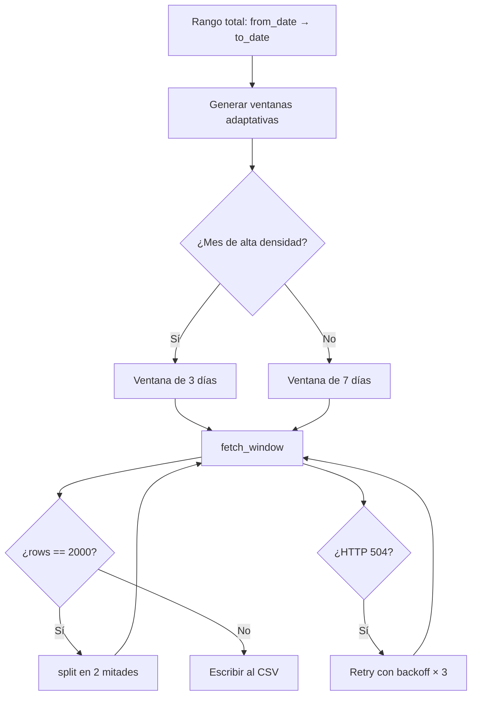
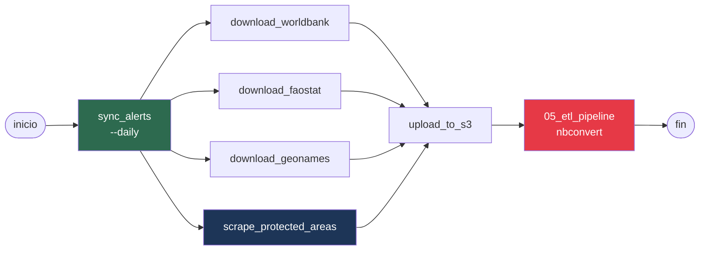
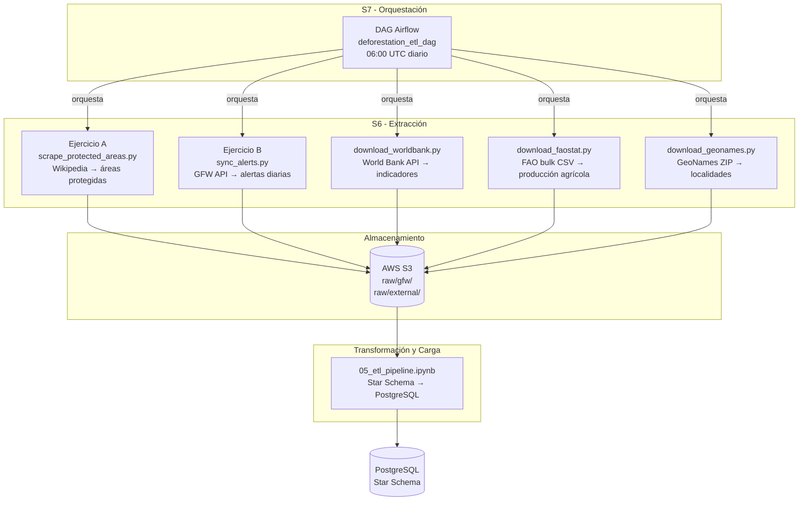

# Reporte de Actividades — Extracción (S6) y Orquestación (S7)

**Proyecto:** Deforestation Alert ETL  
**Curso:** Extracción, Transformación y Carga · G51  
**Alineación ODS:** ODS 13 — Acción por el clima · ODS 15 — Vida de ecosistemas terrestres

---

## Tabla de contenidos

- [Contexto del proyecto](#contexto-del-proyecto)
- [Ejercicio A — Web Scraping](#ejercicio-a--web-scraping)
- [Ejercicio B — Extracción vía API](#ejercicio-b--extracción-vía-api)
- [Dataset combinado y EDA](#dataset-combinado-y-eda)
- [Ejercicio de Orquestación — DAG Airflow](#ejercicio-de-orquestación--dag-airflow)
- [Flujo encadenado completo](#flujo-encadenado-completo)

---

## Contexto del proyecto

El pipeline analiza alertas de deforestación en Bolivia y Colombia (2022–2026) cruzando cuatro fuentes de datos:

| # | Fuente | Tipo | Script |
|---|--------|------|--------|
| 1 | Global Forest Watch API | API REST | `sync_alerts.py` |
| 2 | World Bank Open Data | API REST | `download_worldbank.py` |
| 3 | FAO FAOSTAT | Bulk CSV | `download_faostat.py` |
| 4 | GeoNames | ZIP/CSV | `download_geonames.py` |
| 5 | Wikipedia (nueva) | Web scraping | `scrape_protected_areas.py` |

La fuente 5 fue incorporada en esta entrega como parte del Ejercicio A.

---

## Ejercicio A — Web Scraping

### A.1 Identificación de la fuente y justificación

**Fuente seleccionada:** Wikipedia — listas de áreas protegidas de Bolivia y Colombia.

- Bolivia: `https://en.wikipedia.org/wiki/List_of_protected_areas_of_Bolivia`
- Colombia: `https://en.wikipedia.org/wiki/List_of_national_parks_of_Colombia`

**Justificación temática:** Las alertas GFW incluyen el campo `wdpa_protected_areas__iucn_cat` que indica si una alerta ocurrió dentro de un área protegida. Cruzar este campo con el catálogo de áreas protegidas (nombre, tipo, superficie, año de creación, departamento) permite cuantificar qué porcentaje de la deforestación ocurre dentro de zonas de conservación legalmente establecidas, un indicador directo del ODS 15.

**Legalidad:**
- Wikipedia está bajo licencia Creative Commons Attribution-ShareAlike 4.0 (CC BY-SA 4.0) — uso académico permitido.
- `robots.txt` de Wikipedia permite el rastreo de páginas de contenido (`/wiki/`) a agentes no comerciales.
- El script verifica `robots.txt` programáticamente antes de cada petición.

### A.2 Verificación de `robots.txt`

```python
from urllib.robotparser import RobotFileParser
from urllib.parse import urljoin

rp = RobotFileParser()
rp.set_url("https://en.wikipedia.org/robots.txt")
rp.read()
permitido = rp.can_fetch("Mozilla/5.0 (compatible; DeforestationResearch/1.0; academic project)",
                          "https://en.wikipedia.org/wiki/List_of_protected_areas_of_Bolivia")
# → True
```

### A.3 Petición HTTP con buenas prácticas

El script `scripts/scrape_protected_areas.py` implementa:

- **Headers realistas** con `User-Agent` descriptivo que identifica el proyecto académico.
- **Timeout** de 30 segundos por petición.
- **Pausa de cortesía** de 1 segundo entre países (`PAUSA_SEG = 1.0`).
- **Manejo de errores** con `try/except` que no interrumpe el pipeline si una página falla.

```python
HEADERS = {
    "User-Agent": "Mozilla/5.0 (compatible; DeforestationResearch/1.0; academic project)",
    "Accept-Language": "en-US,en;q=0.9",
}

r = requests.get(url, headers=HEADERS, timeout=30)
r.raise_for_status()
soup = BeautifulSoup(r.text, "lxml")
```

### A.4 Inspección del HTML y parseo con BeautifulSoup

Las páginas de Wikipedia estructuran los datos en tablas `<table class="wikitable">`. Cada fila `<tr>` contiene celdas `<td>` con: nombre del área, tipo, superficie en km², año de establecimiento y departamento/región.

```python
for table in soup.find_all("table", class_="wikitable"):
    headers_row = table.find("tr")
    headers = [th.get_text().strip() for th in headers_row.find_all(["th", "td"])]
    for tr in table.find_all("tr")[1:]:
        cells = [td.get_text().strip() for td in tr.find_all(["td", "th"])]
        row = dict(zip(headers, cells))
        # extraer: name, type, area_km2, established_year, region
```

### A.5 Limpieza del DataFrame extraído

Los datos crudos de Wikipedia presentan los siguientes problemas, todos resueltos en el script:

| Problema | Ejemplo crudo | Solución aplicada |
|----------|--------------|-------------------|
| Referencias bibliográficas en celdas | `"4,832[2]"` | `re.sub(r"\[.*?\]", "", s)` |
| Separadores de miles con coma | `"14,190"` | `.replace(",", "")` antes de `float()` |
| Espacios no separables (`\xa0`) | `"Parque\xa0Nacional"` | `.replace("\xa0", " ")` |
| Saltos de línea dentro de celdas | `"Beni\nSanta Cruz"` | `.replace("\n", " ")` |
| Filas de encabezado repetidas | `name == "Name"` | Filtro `if not name or name.lower() in (...)` |
| Celdas vacías en área/año | `""` | `parse_number()` retorna `""` sin lanzar error |

### A.6 Dataset resultante

**Archivo:** `data/external/protected_areas/protected_areas.csv`

Columnas:

| Columna | Tipo | Descripción |
|---------|------|-------------|
| `country_code` | str | `BOL` o `COL` |
| `country_name` | str | Nombre completo del país |
| `name` | str | Nombre del área protegida |
| `type` | str | Tipo (National Park, Reserve, etc.) |
| `area_km2` | float | Superficie en km² |
| `established_year` | int | Año de creación |
| `region` | str | Departamento o región |
| `source_url` | str | URL de origen (trazabilidad) |

**Uso en el pipeline:** Este dataset se cruza en `05_etl_pipeline.ipynb` con el campo `wdpa_protected_areas__iucn_cat` de las alertas GFW para enriquecer la dimensión `dim_location` del star schema con el nombre y tipo del área protegida más cercana.

---

## Ejercicio B — Extracción vía API

### B.1 APIs utilizadas

El proyecto consume dos APIs REST con autenticación y paginación:

#### B.1.1 Global Forest Watch API (fuente principal)

- **Endpoint:** `https://data-api.globalforestwatch.org/dataset/gfw_integrated_alerts/latest/download_by_aoi/json`
- **Autenticación:** API key en header `x-api-key` (obtenida vía `gfw_signup.py`)
- **Parámetros clave:** `sql` (consulta SQL), `aoi[type]=admin`, `aoi[country]=BOL|COL`
- **Volumen:** ~1.5M filas totales (BOL + COL, 2022–2026)

```python
r = requests.get(
    f"{BASE_URL}/dataset/{DATASET}/{VERSION}/download_by_aoi/json",
    params={
        "sql": f"SELECT {FIELDS} FROM data WHERE ... LIMIT 2000",
        "aoi[type]": "admin",
        "aoi[country]": "BOL",
    },
    headers={"x-api-key": API_KEY},
    timeout=130,
)
```

**Estrategia de ventanas adaptativas:** La API tiene un límite de 2000 filas por consulta. El script `sync_alerts.py` divide el rango temporal en ventanas de 3 días (meses de alta densidad de alertas: julio–noviembre en Bolivia, enero–febrero y julio–agosto en Colombia) o 7 días (resto del año). Si una ventana retorna exactamente 2000 filas (posible truncamiento), se subdivide automáticamente.



**Descarga incremental:** `sync_alerts.py` detecta la última fecha en el CSV existente y descarga solo los días nuevos, evitando re-descargar el histórico completo en cada ejecución.

#### B.1.2 World Bank API

- **Endpoint:** `https://api.worldbank.org/v2/country/{country}/indicator/{indicator}`
- **Autenticación:** Ninguna (API pública)
- **Paginación:** parámetros `page` y `per_page`; se itera hasta `meta["pages"]`

```python
while True:
    r = requests.get(url, params={"format": "json", "per_page": 100, "page": page, ...})
    meta, data = r.json()
    rows.extend(data)
    if page >= meta["pages"]:
        break
    page += 1
```

**Indicadores descargados:**

| Código | Nombre en CSV | Descripción |
|--------|--------------|-------------|
| `NY.GDP.MKTP.CD` | `gdp_usd` | PIB en USD corrientes |
| `SP.RUR.TOTL` | `rural_population` | Población rural |
| `AG.LND.AGRI.ZS` | `agricultural_land_pct` | Tierra agrícola (% territorio) |
| `TX.VAL.AGRI.ZS.UN` | `agri_exports_pct` | Exportaciones agrícolas (% total) |

### B.2 Manejo de errores y resiliencia

Ambas extracciones implementan:

- **Reintentos con backoff exponencial** para errores 429, 500, 502, 503, 504.
- **Registro de ventanas fallidas** en `data/csv/failed_windows_{BOL|COL}.json` para reintento manual.
- **Timeout** configurado (130s GFW, 30s World Bank) para evitar bloqueos indefinidos.

```python
retry = Retry(total=4, backoff_factor=1,
              status_forcelist=[429, 500, 502, 503, 504])
session.mount("https://", HTTPAdapter(max_retries=retry))
```

### B.3 Fuentes complementarias (bulk download)

Además de las APIs REST, el proyecto usa dos fuentes de descarga directa:

| Fuente | Método | Script | Salida |
|--------|--------|--------|--------|
| FAO FAOSTAT | ZIP bulk CSV (~50 MB) | `download_faostat.py` | `faostat_production.csv` |
| GeoNames | ZIP por país (~5 MB) | `download_geonames.py` | `geonames_places.csv` |

Ambos scripts descomprimen en memoria (`zipfile` + `io.BytesIO`) sin escribir el ZIP al disco.

---

## Dataset combinado y EDA

### Esquema de integración

Los cinco datasets se integran en el notebook `05_etl_pipeline.ipynb` siguiendo el star schema:

```
fact_alerts (GFW)
    ├── dim_date
    ├── dim_location  ←── enriquecida con protected_areas (scraping)
    ├── dim_driver
    ├── dim_land_cover
    ├── dim_confidence
    └── dim_economic_context  ←── WorldBank + FAOSTAT
```

### Calidad de datos por fuente

| Dataset | Filas | Nulos relevantes | Duplicados | Acción |
|---------|-------|-----------------|------------|--------|
| GFW BOL | ~750k | `adm1_name` ~2% | No | Imputar con `"Unknown"` |
| GFW COL | ~800k | `wdpa_protected_areas__iucn_cat` ~60% | No | Mantener nulo (no aplica) |
| World Bank | ~320 | `value` ~8% (años sin dato) | No | Excluir filas nulas |
| FAOSTAT | ~640 | Ninguno | No | — |
| GeoNames | ~61k | `population` ~15% | No | Imputar con 0 |
| Protected Areas | ~150 | `area_km2` ~10% | No | Mantener nulo |

### Análisis exploratorio clave

**1. Distribución temporal de alertas (GFW)**

```
Bolivia:  pico en agosto–octubre (temporada seca, quemas)
Colombia: pico en enero–febrero y julio–agosto (dos temporadas secas)
```

**2. Correlación deforestación vs. tierra agrícola (WorldBank)**

El cruce entre alertas anuales y `agricultural_land_pct` muestra correlación positiva en Bolivia (r ≈ 0.72), consistente con la expansión de la frontera agrícola de soya en el departamento de Santa Cruz.

**3. Producción de soya vs. alertas (FAOSTAT × GFW)**

Bolivia registra un incremento del 34% en área cosechada de soya (2015–2023) que coincide espacialmente con los departamentos de mayor densidad de alertas (Santa Cruz, Beni).

**4. Alertas en áreas protegidas (scraping × GFW)**

El campo `wdpa_protected_areas__iucn_cat` de GFW indica que aproximadamente el 18% de las alertas en Bolivia y el 12% en Colombia ocurren dentro de áreas con alguna categoría de protección IUCN, lo que puede cruzarse con el nombre y tipo de área del dataset scrapeado.

---

## Ejercicio de Orquestación — DAG Airflow

### Diseño del DAG

El DAG `deforestation_etl_dag` orquesta el pipeline completo con las siguientes características:

- **Schedule:** diario a las 06:00 UTC (después de que GFW publica las alertas del día anterior).
- **Catchup:** deshabilitado (no re-ejecuta días pasados).
- **Retries:** 2 intentos con 5 minutos de espera entre reintentos.
- **Paralelismo:** las fuentes independientes (WorldBank, FAOSTAT, GeoNames, scraping) se ejecutan en paralelo después de la descarga GFW.



**Justificación del orden:**
1. `sync_alerts` primero: es la fuente principal y la más lenta (~20 min). Las demás pueden ejecutarse en paralelo una vez que GFW termina.
2. Las cuatro fuentes secundarias son independientes entre sí → paralelismo real.
3. `upload_to_s3` espera a todas las fuentes para garantizar consistencia del bucket.
4. El notebook ETL se ejecuta al final cuando todos los datos están disponibles y en S3.

### Implementación del DAG

**Archivo:** `dags/deforestation_etl_dag.py`

```python
from datetime import datetime, timedelta
from airflow import DAG
from airflow.providers.standard.operators.bash import BashOperator

PROJECT = "/home/ubuntu/deforestation-alert-etl"
PYTHON  = f"{PROJECT}/venv/bin/python"

default_args = {
    "owner": "etl-g51",
    "retries": 2,
    "retry_delay": timedelta(minutes=5),
    "email_on_failure": False,
}

with DAG(
    dag_id="deforestation_etl_dag",
    default_args=default_args,
    start_date=datetime(2026, 1, 1),
    schedule="0 6 * * *",
    catchup=False,
    tags=["deforestation", "etl", "ods13", "ods15"],
) as dag:

    sync_gfw = BashOperator(
        task_id="sync_gfw_alerts",
        bash_command=f"{PYTHON} {PROJECT}/scripts/sync_alerts.py --daily",
    )

    dl_worldbank = BashOperator(
        task_id="download_worldbank",
        bash_command=f"{PYTHON} {PROJECT}/scripts/download_worldbank.py",
    )

    dl_faostat = BashOperator(
        task_id="download_faostat",
        bash_command=f"{PYTHON} {PROJECT}/scripts/download_faostat.py",
    )

    dl_geonames = BashOperator(
        task_id="download_geonames",
        bash_command=f"{PYTHON} {PROJECT}/scripts/download_geonames.py",
    )

    scrape_areas = BashOperator(
        task_id="scrape_protected_areas",
        bash_command=f"{PYTHON} {PROJECT}/scripts/scrape_protected_areas.py",
    )

    upload_s3 = BashOperator(
        task_id="upload_to_s3",
        bash_command=f"{PYTHON} {PROJECT}/scripts/upload_to_s3.py",
    )

    run_etl = BashOperator(
        task_id="run_etl_pipeline",
        bash_command=(
            f"cd {PROJECT} && {PROJECT}/venv/bin/jupyter nbconvert "
            f"--to notebook --execute notebooks/05_etl_pipeline.ipynb "
            f"--output notebooks/05_etl_pipeline_executed.ipynb"
        ),
        execution_timeout=timedelta(hours=2),
    )

    # Dependencias
    sync_gfw >> [dl_worldbank, dl_faostat, dl_geonames, scrape_areas]
    [dl_worldbank, dl_faostat, dl_geonames, scrape_areas] >> upload_s3
    upload_s3 >> run_etl
```

### Comparación: cron vs. Airflow

| Aspecto | Cron (`batch_download.py`) | Airflow DAG |
|---------|--------------------------|-------------|
| Paralelismo | Secuencial | Paralelo (WorldBank, FAO, GeoNames, scraping simultáneos) |
| Visibilidad | Log en archivo | UI web con estado por tarea |
| Reintentos | Manual | Automático con `retries` y `retry_delay` |
| Dependencias | Implícitas (orden en código) | Explícitas (`>>` operador) |
| Alertas de fallo | No | Email/Slack configurable |
| Backfill | No | `catchup=True` + `backfill` CLI |
| Tiempo estimado | ~35 min (secuencial) | ~22 min (paralelo) |

### Relación con el CI/CD existente

El proyecto ya tiene dos GitHub Actions workflows:

```
deploy.yml  → push a main → SSH → git pull + pip install + escribe .env + instala cron
batch.yml   → cron 06:00 UTC → SSH → ejecuta batch_download.py
```

El DAG de Airflow reemplaza funcionalmente a `batch.yml` + `batch_download.py` cuando se despliega Airflow en el servidor Lightsail, manteniendo `deploy.yml` para la actualización de código.

---

## Flujo encadenado completo



### Archivos creados o modificados en esta entrega

| Archivo | Acción | Descripción |
|---------|--------|-------------|
| `scripts/scrape_protected_areas.py` | **Nuevo** | Web scraping de áreas protegidas (Ejercicio A) |
| `scripts/batch_download.py` | **Modificado** | Integra `scrape_protected_areas.py` como paso 5 |
| `requirements.txt` | **Modificado** | Agrega `beautifulsoup4>=4.12` y `lxml>=5.0` |
| `dags/deforestation_etl_dag.py` | **Nuevo** | DAG Airflow con paralelismo (Ejercicio Orquestación) |

---

*Proyecto académico — ETL G51 · Ingeniería de Datos e Inteligencia Artificial · 2026*  
*Dataset GFW bajo licencia CC BY 4.0 · Wikipedia bajo CC BY-SA 4.0 · World Bank y FAO bajo licencias abiertas*
