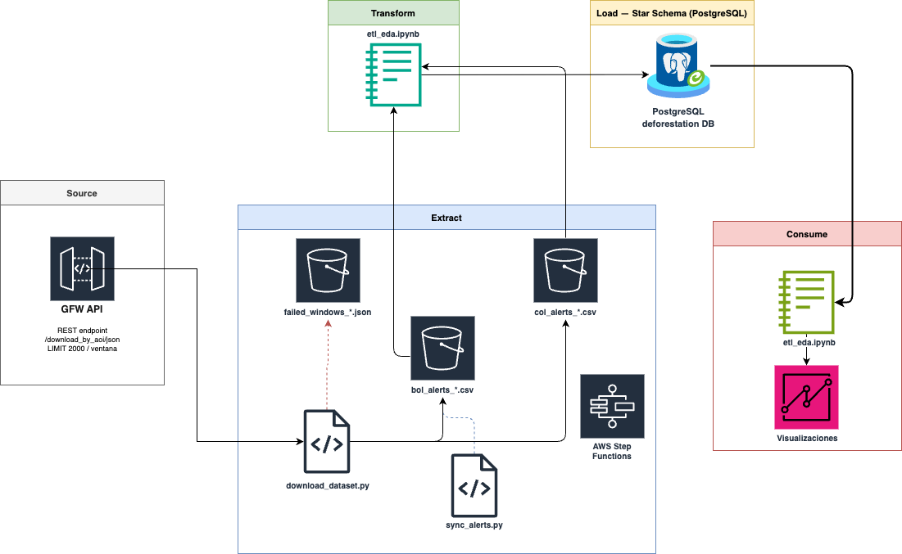
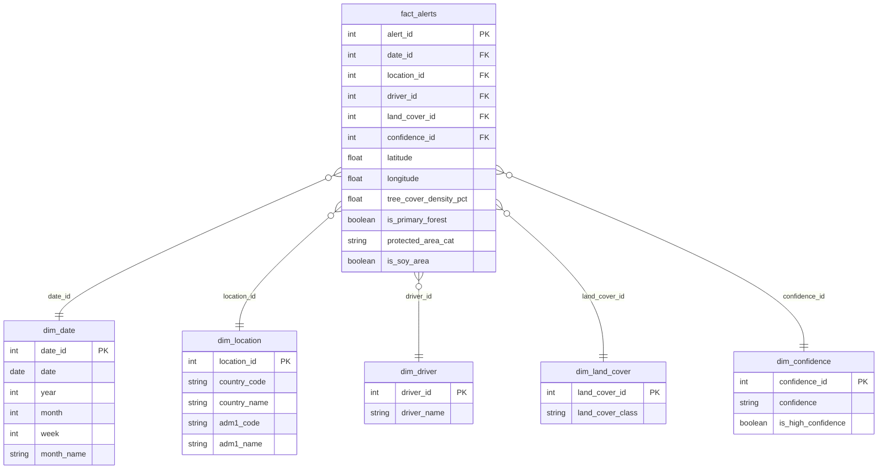

# Respuestas — Primera Entrega ETL (G51)

## 1. Fuente de datos estructurada alineada a los ODS

**Fuente:** Global Forest Watch (GFW) — dataset `gfw_integrated_alerts`  
**URL:** https://data-api.globalforestwatch.org  
**Tipo:** Estructurado (JSON/CSV vía API REST)  
**Países cubiertos:** Bolivia (BOL) y Colombia (COL)  
**Rango temporal:** 2022-01-01 → 2026-07-30  

**Alineación con los ODS:**
- **ODS 13 — Acción por el clima:** Las alertas de deforestación son un indicador directo de emisiones de CO₂ por pérdida de cobertura forestal.
- **ODS 15 — Vida de ecosistemas terrestres:** El dataset registra pérdida de bosque primario, categorías de uso del suelo y presencia en áreas protegidas.

**Justificación de la elección:**
- Datos a nivel de evento (cada fila = un píxel con alerta), lo que permite análisis espacial y temporal granular.
- 1,523,990 filas y 12 columnas originales (más columnas derivadas en la transformación), superando ampliamente el mínimo de 10,000 filas y 10 features requerido.
- Fuente oficial, actualizada periódicamente, con cobertura global y API pública documentada.

---

## 2. Extracción de datos

La extracción se realiza mediante el script `scripts/download_dataset.py`, que consume la API REST de GFW con el endpoint:

```
GET /dataset/gfw_integrated_alerts/latest/download_by_aoi/json
    ?sql=SELECT ... FROM data WHERE date BETWEEN ... LIMIT 2000
    &aoi[type]=admin
    &aoi[country]=BOL|COL
    &x-api-key=<GFW_API_KEY>
```

**Estrategia de extracción:**
- Ventanas temporales adaptativas por país (3 días en meses de alta densidad, 7 días en el resto).
- Si una ventana falla (error 504 por alta densidad de alertas), se divide recursivamente en mitades hasta llegar a ventanas de 1 día.
- Cada país se guarda en un CSV separado: `data/csv/bol_alerts_*.csv` y `data/csv/col_alerts_*.csv`.
- Las ventanas irrecuperables se registran en `failed_windows_{COUNTRY}.json` para reintento manual.

**Meses de alta densidad por país:**
| País | Meses alta densidad | Ventana | Ventana normal |
|------|---------------------|---------|----------------|
| Bolivia (BOL) | 7, 8, 9, 10, 11 (temporada seca) | 3 días | 7 días |
| Colombia (COL) | 1, 2, 7, 8 | 3 días | 7 días |

**Volumen obtenido:**
| País | Filas | Tamaño CSV | Rango real |
|------|-------|------------|------------|
| Bolivia (BOL) | 724,000 | 46 MB | 2022-01-01 → 2026-07-30 |
| Colombia (COL) | 799,990 | 49 MB | 2022-01-01 → 2026-07-30 |
| **Total** | **1,523,990** | **95 MB** | |

**Ventanas fallidas pendientes:**
- Bolivia: 4 ventanas (2024-10-02, 2024-10-22, 2024-10-24, 2024-11-01) — días individuales de alta densidad irrecuperables vía API.
- Colombia: 0 ventanas fallidas.

**Sincronización incremental:**  
El script `scripts/sync_alerts.py` permite actualizar los CSV con nuevas alertas sin re-descargar el histórico completo. Detecta automáticamente la última fecha registrada en el CSV y descarga solo desde ese punto.

```bash
python scripts/sync_alerts.py              # descarga desde última fecha hasta ayer
python scripts/sync_alerts.py --daily      # solo el día de ayer (modo cron)
python scripts/sync_alerts.py --country BOL  # solo un país
```

---

## 3. ¿Batch o Streaming?

**Estrategia utilizada: Batch**

**Justificación:**
- GFW publica alertas con una latencia de 1–3 días desde la detección satelital; no existe un flujo en tiempo real disponible públicamente.
- El análisis del proyecto es retrospectivo y comparativo (tendencias anuales, estacionalidad), no requiere procesamiento en tiempo real.
- El volumen por ventana (hasta 2,000 registros) y la frecuencia de actualización (diaria/semanal) son compatibles con cargas batch programadas.

---

## 4. ¿Carga completa o incremental?

**Estrategia utilizada: Incremental (después de la carga inicial)**

**Justificación:**
- La carga inicial fue completa (2022 → 2026-07-30), descargando todo el histórico disponible.
- Las ejecuciones posteriores son incrementales: `sync_alerts.py` detecta la última fecha en el CSV y descarga solo desde ese punto, evitando re-procesar 1.5M de filas ya almacenadas.
- El campo `gfw_integrated_alerts__date` actúa como marca de agua (*watermark*) para determinar el punto de corte.

---

## 5. Exploración del conjunto de datos (EDA)

### Estructura del dataset (12 columnas originales)

| Columna original | Tipo | Descripción |
|-----------------|------|-------------|
| `latitude` | float | Coordenada geográfica (eje Y) |
| `longitude` | float | Coordenada geográfica (eje X) |
| `gfw_integrated_alerts__date` | date | Fecha de detección de la alerta |
| `gfw_integrated_alerts__confidence` | string | Nivel de confianza: `high` / `highest` / `nominal` |
| `umd_tree_cover_density_2000__percent` | int | Densidad de cobertura arbórea en 2000 (0–100%) |
| `is__umd_regional_primary_forest_2001` | int (bool) | 1 si el píxel era bosque primario en 2001 |
| `wdpa_protected_areas__iucn_cat` | int | Categoría IUCN del área protegida (0 = no protegida) |
| `esa_land_cover_2015__class` | string | Clase de uso del suelo en 2015 |
| `wri_google_tree_cover_loss_drivers__category` | int | Código numérico del driver de pérdida forestal |
| `gadm_administrative_boundaries__adm1` | int | ID del departamento/región administrativa (nivel 1) |
| `is__umd_soy_planted_area_buffered_10km` | int (bool) | 1 si está dentro de 10 km de área de soya |

### Nulos y calidad de datos

| País | Columna con nulos | Nulos | % |
|------|-------------------|-------|---|
| Bolivia | `esa_land_cover_2015__class` | 174 | 0.02% |
| Colombia | `esa_land_cover_2015__class` | 27,037 | 3.38% |

- Las columnas clave (`date`, `latitude`, `longitude`, `confidence`) no tienen nulos.
- `loss_driver_category = 255` es el código para "driver desconocido": BOL 9.7%, COL 15.7%.
- Duplicados: 0 en ambos países.

### Distribución temporal

**Alertas por año:**
| Año | Bolivia | Colombia |
|-----|---------|----------|
| 2022 | 162,000 | 152,474 |
| 2023 | 164,000 | 147,526 |
| 2024 | 167,492 | 194,000 |
| 2025 | 159,951 | 183,371 |
| 2026 (parcial) | 70,557 | 122,619 |

### Drivers de pérdida forestal

| Código | Driver | Bolivia | Colombia |
|--------|--------|---------|----------|
| 1 | Agricultura | 310,799 | 475,163 |
| 2 | Ganadería | 6,313 | 19,067 |
| 3 | Silvicultura | 41,150 | 103,116 |
| 4 | Minería | 38,673 | 36,934 |
| 5 | Infraestructura | 156,680 | 1,286 |
| 6 | Incendios | 1,215 | 1,004 |
| 7 | Otro | 98,671 | 38,183 |
| 255 | Sin clasificar | 70,499 | 125,237 |

### Bosque primario vs. secundario

| País | Bosque primario | Bosque secundario | % primario |
|------|----------------|-------------------|------------|
| Bolivia | 676,781 | 47,219 | 93.5% |
| Colombia | 640,254 | 159,736 | 80.0% |

---

## 6. Transformaciones aplicadas

| Transformación | Implementación | Motivo |
|----------------|---------------|--------|
| Renombrar 12 columnas | `df.columns = [...]` | Nombres originales largos con `__` |
| Extraer `year`, `month`, `week`, `month_name` | `dt.year`, `dt.isocalendar()` | Facilita agrupaciones en SQL |
| Crear `is_high_confidence` | `.isin(['high', 'highest'])` | Simplifica filtros por calidad |
| Mapear `adm1_code` → `adm1_name` | Diccionarios `ADM1_BOL` / `ADM1_COL` | ID numérico no interpretable |
| Mapear `loss_driver_category` → `driver_name` | Diccionario `DRIVER_MAP` | Códigos 1–7, 255 no autoexplicativos |
| Agregar `country_code` | Parámetro de carga | Necesario para unificar BOL y COL |
| Resolver FKs a dimensiones | `map()` sobre índices de dims | Normalización al Star Schema |

---

## 7. Arquitectura ETL y modelo de datos





### Modelo de datos — Star Schema



**Justificación del stack:**

| Capa | Herramienta | Justificación |
|------|-------------|---------------|
| Extracción | Python + requests | Consumo de API REST con manejo de errores y reintentos |
| Almacenamiento raw | CSV por país | Checkpoint de recuperación ante fallos de la API |
| Base de datos | PostgreSQL | RDBMS con soporte completo de JOINs, índices y tipos de datos |
| Transformación | pandas | Renombrado, derivación de columnas, resolución de FKs |
| Visualización | matplotlib + seaborn | Gráficos estadísticos reproducibles en Jupyter |
| Orquestación | Jupyter Notebook | Reproducibilidad y documentación integrada |

---

## 8. Fuentes complementarias sugeridas

| Fuente | Datos que aporta | Cómo potencia el análisis |
|--------|-----------------|--------------------------|
| **Global Precipitation Measurement (GPM / NASA)** | Precipitación mensual por coordenada | Correlacionar deforestación con sequías |
| **FAO FAOSTAT** | Producción agrícola (soya, ganadería) por país y año | Contrastar el driver `Agricultura` con expansión agropecuaria real |
| **WDPA (Protected Planet)** | Polígonos de áreas protegidas con categoría IUCN | Enriquecer `protected_area_cat` con nombre y superficie del área |
| **Banco Mundial** | PIB, población rural, índice de gobernanza | Contextualizar si la deforestación correlaciona con presión económica |
